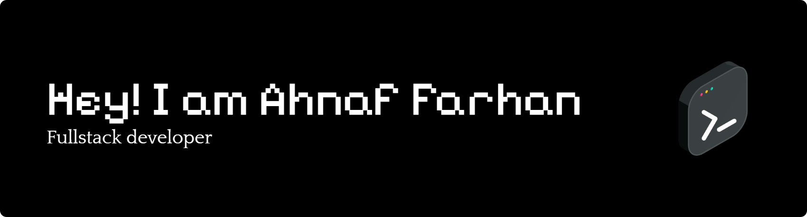

</img>

<h2>👋Hey there! I'm Ahnaf</h2>

<!-- ## 👋 &nbsp;Hey there! I'm Ahnaf -->

### 👨🏻‍💻 &nbsp;About Me

💡 &nbsp;I like to explore new technologies and develop software solutions and quick hacks.\
🎓 &nbsp;I'm currently working at @Aribaas-Ventures-LTD and Creatifi Studios as a Fullstack Web Dev.\
🌱 &nbsp;I'm on track for learning more about Artificial Intelligence, Advanced API's and Deep Backend Security Designs and Integrations.\
✍️ &nbsp;In my free time, I like to sip a coffee and watch web series.\
💬 &nbsp;Feel free to reach out to me for hiring me or consulting and volunteering, or just for some interesting discussion.\
✉️ &nbsp;You can shoot me an email at ahnaffarhanhossain@gmail.com! I'll try to respond as soon as I can.\
📄 &nbsp;Please have a look at my [Portfolio](https://ahnaf.dev) for more details about me. I'm open to feedback and suggestions!

### 🛠 &nbsp;Tech Stack

&nbsp;
&nbsp;
&nbsp;
&nbsp;

&nbsp;
&nbsp;
&nbsp;
&nbsp;
&nbsp;

&nbsp;
&nbsp;
&nbsp;
&nbsp;

&nbsp;
&nbsp;
&nbsp;
&nbsp;

&nbsp;

### ⚙️ &nbsp;GitHub Analytics

### 🤝🏻 &nbsp;Connect with Me

